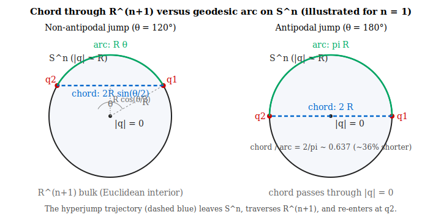

# Hyperjump via the Fourth Spatial Dimension

**Author:** Norbert Nopper

---

## Abstract

Within the Quaternion-Hypersphere Theory of Spacetime [Nopper 2025a], the spatial universe is a closed three-sphere $S^3$ of radius $R(\tau)$, parameterized by quaternions $q = \xi + x\mathbf{i} + y\mathbf{j} + z\mathbf{k}$ with $|q| = R$. This note examines whether two points of $S^3$ separated by an angular distance $\theta$ can be connected by a trajectory that leaves the hypersurface, traverses the interior of the four-dimensional Euclidean embedding $\mathbb{R}^4$ as a straight chord, and re-enters at the destination. The chord is strictly shorter than any geodesic arc on $S^3$; in operational terms — for an observer confined to $S^3$ — the traveller arrives sooner than a light signal travelling along $S^3$ would, so the trajectory is superluminal in $S^3$ projection while remaining timelike in the bulk metric. As a candidate dynamical skeleton we propose a quaternionic linear sigma model in which $|q|$ is a dynamical degree of freedom and the vacuum manifold $\{|q| = R\}$ confines ordinary matter to $S^3$. The resulting field equations are globally smooth on $\mathbb{R}_\tau \times \mathbb{R}^4$, including at $|q| = 0$, and the chord-traversal becomes either a classical over-the-barrier trajectory or a quantum-tunnelling process. Eight substantial pieces remain to be supplied — cosmic expansion, coupling to gravity, Standard-Model matter content, the Goldstone-mode mass problem, a fixed value for the single coupling $\lambda$, reconciliation with the intrinsic light-speed bound of [Nopper 2025a], a field-theoretic tunnelling-rate calculation, and a UV completion of the (non-renormalizable) quartic interaction. These open subproblems are listed explicitly with first-pass closures. The note is therefore best read as a *programme* rather than a finished theory; it makes no precision predictions for laboratory observables beyond those already implied by the underlying braneworld and sigma-model literature, and there is no experimental evidence for macroscopic traversal of extra dimensions.

---

## The Geometric Argument

A point on the spatial hypersphere satisfies $|q| = R$. (Note: that the spatial universe is closed with $S^3$ topology is a *premise* taken from [Nopper 2025a]; current cosmological data are consistent with this premise but do not establish it — see §Experimental Programme.) Two points $q_1, q_2 \in S^3_R$ separated by angular distance $\theta$ admit two path types: a geodesic *arc* of length $R\theta$ that stays on $S^3$, and a straight-line *chord* through the embedding $\mathbb{R}^4$ of length $2R\sin(\theta/2)$. The two-dimensional analogue ($S^1 \subset \mathbb{R}^2$) is shown below.

| Path | Parameterization | Length |
|------|-----------------|--------|
| Geodesic on $S^3$ (normal travel) | $\text{slerp}(q_1, q_2,\, t)$, $\lVert q(t) \rVert = R$ | $R\theta$ |
| Chord through $\mathbb{R}^4$ bulk (hyperjump) | $(1-t)\,q_1 + t\,q_2$, $\lVert q(t) \rVert \leq R$ | $2R\sin(\theta/2)$ |

Since $\sin(\theta/2)/(\theta/2) \leq 1$ for all $\theta \in (0, \pi]$, the chord is never longer than the arc. The maximum shortcut occurs at the antipodal point ($\theta = \pi$): chord $= 2R$ versus arc $= \pi R$ — a reduction of approximately 36 %. At bulk speed $v \leq c$ the crossing time is $\Delta\tau = 2R\sin(\theta/2)/v$, strictly finite and timelike with respect to the bulk metric.

It must be acknowledged that *from the perspective of an $S^3$-confined observer* the chord traverser arrives sooner than a light signal travelling along $S^3$ between the same endpoints. The effective $S^3$-projected speed for an antipodal chord at bulk speed $c$ is $\pi c / 2 \approx 1.57\,c$. The trajectory is therefore operationally superluminal in $S^3$ projection. This is consistent with the bulk light-cone but in tension with the FTL prohibition in [Nopper 2025a, §Light-Speed Bound], which is formulated *intrinsically* on $S^3$. The resolution adopted here — extending the causal-cone definition to the bulk Minkowski metric — is given as the first-pass closure of subproblem 6 below.

For an antipodal jump the chord passes through $|q| = 0$ at its midpoint; for non-antipodal jumps it passes through a minimum norm $R\cos(\theta/2) > 0$. The bulk origin $|q| = 0$ is a point of the auxiliary embedding $\mathbb{R}^4$ at the present cosmic time $\tau$; it is *not* the FLRW initial singularity at $\tau = 0$, although both share the property that $|q| = 0$.

---

## A Candidate Dynamical Skeleton: Quaternionic Linear Sigma Model

The SpacetimeTheory designates $\mathbb{R}^4$ as an *auxiliary* embedding space and defines matter only on $S^3$ [Nopper 2025a, §Foundations]. To make the hyperjump a physical process, the kinematic constraint $|q| = R$ must be replaced by dynamics: an action principle that admits both $S^3$-confined ground states and chord-like excited trajectories.

We propose, as the simplest candidate skeleton, a Lorentz-invariant linear sigma model with global $O(4)$ symmetry on the bulk $\mathcal{B} = \mathbb{R}_\tau \times \mathbb{R}^4$. Treating the quaternion $q$ as a real 4-component scalar field $q^A$ ($A = 1,\dots,4$) with $|q|^2 \equiv q^A q^A = \xi^2 + x^2 + y^2 + z^2$:

$$\mathcal{L} \;=\; -\tfrac{1}{2}\,\eta^{\mu\nu}\,\partial_\mu q^A\,\partial_\nu q^A \;-\; \lambda\bigl(q^A q^A - R^2\bigr)^2$$

with $\eta_{\mu\nu} = \mathrm{diag}(-c^2, +1, +1, +1, +1)$ and an implicit sum over $A$. Structurally this is the Higgs sector with the vacuum manifold $\{q^A q^A = R^2\} \cong S^3$ reinterpreted geometrically as the spatial universe of [Nopper 2025a].

**Conventions and dimensions.** Throughout this note we use natural units $\hbar = c = 1$ unless otherwise stated. In five spacetime dimensions a canonically normalized real scalar $q^A$ has mass dimension $3/2$; the parameter $R$ in the Lagrangian is then the vacuum expectation value $\lvert\langle q\rangle\rvert$, also of mass dimension $3/2$, and the coupling $\lambda$ has mass dimension $-1$ (confirming non-renormalizability — see Subproblem 8). The geometric radius of the spatial $S^3$ — the quantity referred to as $R$ in §The Geometric Argument and elsewhere — is identified with the vev $R$ only after coupling to 5D gravity (Subproblem 2), which fixes the relative normalization between field-space distance and spacetime distance. Within the present sigma-model-only treatment, $R$ should be read as the vev; geometric statements such as "$|q| = R$ defines the spatial universe" are to be understood modulo this identification. All formulas $\rho_\star = \lambda R^4$, $\ell_\perp = 1/(\sqrt\lambda R)$, etc., refer to the vev throughout, and are dimensionally consistent in canonical conventions.

The skeleton does three things:

| Feature | Mechanism |
|---------|-----------|
| Field $q$ becomes dynamical | $\lvert q \rvert$ is no longer a kinematic constraint |
| Equations of motion are globally smooth | $\Box q^A = 4\lambda\bigl(\lvert q \rvert^2 - R^2\bigr)\,q^A$ is well-posed everywhere on $\mathcal{B}$, including at $\lvert q \rvert = 0$ |
| The bulk origin is non-singular | $V(0) = \lambda R^4$ is finite; the chord encounters a finite barrier, not a divergence |

Excitations with energy density above the central barrier $\rho_\star = \lambda R^4$ classically traverse the bulk along chord trajectories; excitations below the barrier tunnel quantum-mechanically (rate calculable via the Coleman–De Luccia bounce, not the 1D-WKB formula sometimes used heuristically). The single coupling $\lambda$ controls the *brane thickness* $\ell_\perp \sim 1/(\sqrt{\lambda}\,R)$, the *barrier energy density* $\rho_\star = \lambda R^4$, and via the product $\rho_\star V_{\text{cargo}} c\Delta\tau$ the *energy cost* of transporting an object through the bulk.

This much is a clean kinematic skeleton. It is **not yet a complete physical theory**.

---

## Open Subproblems

The skeleton above leaves eight substantial pieces unsupplied. Each is an explicit open problem; the model becomes a candidate physical theory only when all are addressed. Each item is given a textbook-level *first-pass closure* inline — a starting point, not a final solution. The depth of the residual work varies considerably: items 1–5 reduce to standard exercises in scalar-field cosmology, braneworld gravity, brane localization, gauge symmetry breaking, and dimensional analysis; items 6–7 require dedicated technical follow-ups (causal-structure reformulation, full bounce computation); item 8 is a deferral to a UV-completion programme that lies outside the scope of any single note.

1. **Cosmic expansion.** [Nopper 2025a] has $R = R(\tau)$ (FLRW). The static $R$ in $\mathcal{L}$ is incompatible. *First-pass closure:* promote $R \to \Phi(\tau)$ with potential $U(\Phi)$ and add a kinetic term $-\tfrac{1}{2}(\partial\Phi)^2$. The homogeneous mode then satisfies $\ddot\Phi + 3H\dot\Phi + U'(\Phi) = 0$, the standard scalar-field-cosmology equation [Linde 1990]; for slow-roll choices of $U$ this reproduces de Sitter expansion. Full closure requires coupling to 5D gravity (Subproblem 2) so that $H$ is itself a solution rather than a postulate.
2. **Coupling to gravity.** The bulk is treated as flat. To recover the FLRW geometry as a *solution* rather than a postulate, the action must be coupled to 5D General Relativity, $S = \int d^5x\sqrt{-g}\,[\mathcal{R}^{(5)}/(2\kappa_5^2) + \mathcal{L}_q]$, in the spirit of Randall-Sundrum / DGP braneworlds. *First-pass closure:* in the thin-brane limit $\ell_\perp \to 0$, the energy-momentum tensor of $q$ degenerates to a delta-function source on $S^3$ and the 5D Einstein equations reduce to Israel junction conditions [Israel 1966]; the induced 4D geometry is then standard FLRW with the brane tension $\sigma = \int d\ell_\perp\,V(|q|)$ playing the role of an effective cosmological constant. A finite-$\ell_\perp$ treatment requires solving the coupled $(g_{MN}, q)$ system numerically.
3. **Standard-Model matter on the brane.** Real matter is not a quaternion sigma model. *First-pass closure:* introduce a 5D Dirac fermion $\Psi$ with Yukawa coupling $h\,\bar\Psi\Psi\,(|q|^2 - R^2)$ [Rubakov-Shaposhnikov 1983]. The transverse Dirac equation $\bigl[i\gamma^\perp\partial_\perp - h(|q|^2 - R^2)\bigr]\Psi = 0$ admits a single normalizable zero mode with profile $\Psi_0(r) \propto \exp\bigl[-h\!\int^r(|q|^2 - R^2)\,dr'\bigr]$ peaked on $S^3$ and exponentially suppressed in the bulk; this is the 4D Standard-Model fermion. Gauge bosons can be localized by analogous dilaton-type couplings [Dvali-Shifman 1997]. Recovering the full SM spectrum (chirality, generations, Higgs) within this framework is non-trivial but follows established braneworld phenomenology.
4. **Goldstone-mode mass problem.** The breaking $O(4) \to O(3)$ produces three exactly massless scalars not seen in nature. *First-pass closure:* gauge the connected component $SO(4)$ by introducing gauge fields $A_\mu^a$ ($a = 1,\dots,6$) and replacing $\partial_\mu q^A \to D_\mu q^A = \partial_\mu q^A - igA_\mu^a (T^a)^A{}_B q^B$, plus the Yang-Mills term $-\tfrac{1}{4}F^a_{\mu\nu}F^{a\,\mu\nu}$. After symmetry breaking, the three broken generators give three massive vector bosons with masses $m_A \sim gR$; the three Goldstones become their longitudinal components via the Higgs mechanism. The remaining $SO(3)$ gauge bosons stay massless and would need to be either confined or identified with a known sector — itself a non-trivial phenomenological constraint.
5. **Determination of $\lambda$.** The coupling is unconstrained, so the model is not predictive. *First-pass closure:* the brane-thickness relation $\ell_\perp = 1/(\sqrt\lambda\,R)$ combined with the experimental upper bound on the size of any unobserved transverse dimension, $\ell_\perp \lesssim \ell_{\exp} \approx 44\,\mu\text{m}$ [Adelberger et al. 2003], gives the lower bound $\sqrt\lambda \geq 1/(\ell_{\exp} R)$. With $R$ of order the Hubble radius, this places $\lambda$ many orders of magnitude above zero but leaves it otherwise unfixed; pinning a unique value would require an independent observable (e.g. a Kaluza-Klein-type signature, a tunnelling rate, or a cosmological constraint on $\Phi$).
6. **Operational FTL versus [Nopper 2025a]'s prohibition.** Chord traversal is timelike in the bulk but superluminal in $S^3$ projection. *First-pass closure:* adopt the bulk Minkowski light-cone of $\eta_{\mu\nu} = \mathrm{diag}(-c^2, +1, +1, +1, +1)$ as the *fundamental* causal structure, and reinterpret [Nopper 2025a]'s intrinsic light-speed bound as an emergent statement about $S^3$-confined matter — strictly valid only for trajectories that remain on the brane. Chord trajectories then satisfy the bulk light-cone and contain no closed timelike curves, since $\mathcal{B} = \mathbb{R}_\tau \times \mathbb{R}^4$ is globally hyperbolic. The standard "FTL implies CTCs by Lorentz-boosting" argument does *not* apply here, because the FLRW embedding picks out a preferred cosmic-time slicing and brane Lorentz boosts are not a true symmetry of the full theory; FTL in the brane projection therefore does not generate closed signal loops. The cost is conceptual: the "intrinsic" formulation of light-speed in [Nopper 2025a] must be downgraded to an effective brane-projected bound, and Lorentz invariance of the brane physics becomes approximate rather than exact (constrained by precision tests of vacuum Lorentz invariance — see Tier 1 below). An alternative — adding a chronology-protection term that suppresses the field amplitude near $\lvert q \rvert = 0$ — preserves the intrinsic formulation but reintroduces an arbitrary suppression scale.
7. **Tunnelling rate.** A field-theoretic Coleman–De Luccia bounce calculation [Coleman 1977; Coleman & De Luccia 1980] should replace the 1D-WKB heuristic; this gives the actual jump amplitude as a function of $\lambda$, $R$, and cargo geometry. *First-pass closure:* the relevant process is barrier penetration, not false-vacuum decay — the system is already in the true vacuum and tunnels through the central bump $V(0) = \lambda R^4$. Dimensional analysis of the Euclidean instanton gives a bounce action $B$ that grows polynomially in $\sqrt\lambda\,R$ (the dimensionless combination controlling both the barrier and the wall tension $\sigma \sim \sqrt\lambda\,R^3$), so the tunnelling rate per unit volume scales as $\Gamma/V \sim \mu^5 e^{-B/\hbar}$ with $\mu$ a characteristic mass scale. For cosmological $R$ and $\lambda$ saturating Subproblem 5's lower bound, $B \gg \hbar$ and the spontaneous rate is negligible — consistent with non-observation, but also implying that *unaided* hyperjumps are exponentially suppressed and would require an external coherent source to occur on macroscopic timescales. A full computation of the bounce profile and its prefactor is required to fix the exact exponent.
8. **UV completion.** The quartic interaction $\lambda(|q|^2 - R^2)^2$ is non-renormalizable in five spacetime dimensions; the Lagrangian is therefore at best an effective theory below some cutoff $\Lambda$. *First-pass framing:* treat the action as a Wilsonian EFT valid for energies $E \ll \Lambda \lesssim M_{\text{Pl}}^{(5)}$ (the 5D Planck mass after Subproblem 2 is implemented). Within that range the model is predictive in the EFT sense — operators of dimension $> 5$ are suppressed by powers of $E/\Lambda$ — which suffices for any prediction at sub-Planckian scales, including the chord-traversal energetics. A genuine UV completion (asymptotic safety, embedding in a higher-symmetry or string-theoretic theory) lies beyond the scope of this note and is not supplied here.

A consistent closure of items 1–2 alone would already promote the proposal from a kinematic skeleton to a candidate dynamical theory; items 3–5 and 7 would make it phenomenologically meaningful; item 6 reframes the causal structure of [Nopper 2025a]; item 8 is a deferral to a UV-completion programme.

---

## Experimental Programme

The model's predictions split cleanly into two regimes: properties of the *underlying sigma-model and brane structure*, which are testable with existing or near-term experiments, and properties of *macroscopic chord traversal itself*, which are not testable with any foreseeable technology.

### Tier 1 — Tests parasitic on running or near-term experiments

| Observable | What it constrains | Status |
|------------|-------------------|--------|
| Sub-mm gravity (Eöt-Wash, MICROSCOPE) | Brane thickness $\ell_\perp \to$ bound on $\lambda$ via Subproblem 5 | Currently $\ell_\perp \lesssim 44\,\mu\text{m}$ [Adelberger et al. 2003]; next-generation reaches $\sim\!1\,\mu\text{m}$ |
| Fifth-force / new long-range vector searches | Residual unbroken $SO(3)$ gauge bosons (Subproblem 4) must be confined or below sensitivity | Tight bounds on any massless vector mediator |
| CMB scalar/tensor ratio (Planck, LiteBIRD, CMB-S4) | Shape of the inflaton potential $U(\Phi)$ in Subproblem 1 | Tightening $r$ disfavours specific $U(\Phi)$ |
| Spatial-curvature and topology tests (CMB matched circles) | The model presupposes a closed $S^3$ universe of finite radius $R$ | Data consistent with flat or slightly closed; no positive detection |

### Tier 2 — Dedicated or next-generation facilities

| Observable | What it constrains |
|------------|-------------------|
| KK-like resonances and missing-energy events at HL-LHC / FCC-hh | Bulk-propagating excitations of $q^A$; matter briefly entering the bulk |
| Precision Higgs couplings | Mixing between the SM Higgs and the radial (massive) mode of $q^A$ |
| Dark-energy equation of state $w(z)$ | Trajectory of $\Phi(\tau)$ on $U(\Phi)$ |

### Tier 3 — The hyperjump itself

Given the exponential suppression in Subproblem 7, no terrestrial experiment can plausibly produce a macroscopic chord traversal. Conceptual milestones, in increasing order of difficulty:

1. **Microscopic tunnelling event.** Observation of a single quantum appearing at an unexpected location with a rate consistent with the bounce calculation, after excluding all conventional channels. Astronomically rare for any $\lambda$ within current bounds.
2. **Coherent-source proof of principle.** A configuration raising $q^A$ above the central barrier in a small region. The required energy density $\rho_\star = \lambda R^4$ is bounded below by Subproblem 5's lower bound on $\sqrt\lambda$, and for cosmological-scale $R$ is extreme by any laboratory standard — comparable to or above the Planck density in the relevant dimensional combinations, and of the same order of magnitude (in absolute terms) as the negative-energy-density requirements of warp/wormhole proposals.
3. **Macroscopic chord traversal.** Direct observation of an object appearing near its antipode in less than light-travel time on $S^3$. Not forbidden by the framework, but on no plausible engineering horizon.

### Falsification criteria

The proposal is *falsified* (in the strong Popperian sense) if any of the following obtains:

- Cosmological observations conclusively establish a flat or open spatial universe ($\Omega_k \geq 0$ to high precision), eliminating the closed-$S^3$ premise of [Nopper 2025a];
- Sub-mm gravity tests push $\ell_\perp$ below the value at which the brane localization mechanism of Subproblem 3 ceases to admit a normalizable zero-mode for Standard-Model fermions of the observed masses;
- Precision tests of Lorentz invariance in vacuum exclude the bulk light-cone reformulation of Subproblem 6 at the level required for the chord trajectories to remain consistent with observed brane physics;
- A graviton Kaluza-Klein tower with mass spacing or angular-momentum content inconsistent with a single transverse non-compact dimension is established at any future collider or astrophysical observation.

### Honest summary

The *theory* is empirically engageable through existing programmes; Tier 1 alone could in principle falsify it within a decade. The *device* — hyperjump propulsion — is not on any plausible engineering horizon and would require physics or technology beyond what is currently available.

### In-principle possibility

Subject to the obvious disclaimers, the framework contains no in-principle prohibition against constructing a hyperjump device. What it contains are quantitative obstacles: depositing energy density $\rho_\star = \lambda R^4$ coherently in the cargo volume (extreme by any laboratory standard for cosmological-scale $R$), maintaining quantum coherence of the bulk excitation across the chord, and either accepting the exponentially small spontaneous tunnelling rate or engineering a resonant/stimulated enhancement. Each is severe; none is forbidden.

In this respect the proposal sits in the same epistemic category as traversable wormholes [Morris & Thorne 1988] and the Alcubierre warp metric [Alcubierre 1994]: physically permitted within a self-consistent theoretical framework, but with engineering requirements far beyond present extrapolation. One distinguishing structural feature is worth noting: the chord traversal **does not require violation of the energy conditions of general relativity** — it requires only ordinary positive-energy excitations of the sigma-model field above a finite barrier $V(0) = \lambda R^4$, whereas wormhole and Alcubierre constructions require negative energy density (exotic matter). Whether this counts as a *practical* advantage is debatable, since the absolute energy-density scale required here is itself extreme; what is unambiguous is that the *qualitative* obstacle is different.

The honest classification is therefore: *in-principle possible, technologically remote, and structurally distinct from negative-energy-density proposals*.

---

## Note on the Interval-Number Framework

Earlier formulations of this proposal invoked the interval-number algebra of [Nopper 2025b] to regularize formal expressions of the type $\rho_{\text{bulk}} \cdot V_{\text{bulk}} \sim |q|^{-3} \cdot |q|^3 \to 0 \cdot \infty$ that arise if one extends FLRW-style densities into the bulk via $|q|$. Within the sigma-model skeleton above, no such densities appear: the action is governed by the Lagrangian $\mathcal{L}$, which is finite everywhere. The interval-number framework therefore plays no role in the present formulation. It remains an independent, self-consistent algebraic system [Nopper 2025b] and may still be useful for other extensions of the theory in which genuinely indeterminate forms appear.

---

## Summary

| Framework | Role |
|-----------|------|
| Quaternion-Hypersphere Theory [Nopper 2025a] | Identifies $\mathbb{R}^4$ as the embedding space; supplies chord-path geometry and the $S^3$ vacuum structure |
| Quaternionic linear sigma model (this note) | Provides a candidate bulk Lagrangian whose vacuum manifold is $S^3$ and whose excited states traverse the bulk |

The model is **geometrically coherent and singularity-free**, but **not yet dynamically complete**: the eight open subproblems listed above must be closed before it can be considered a candidate physical theory. Each admits a textbook-level first-pass closure sketched inline (with item 8 framed as a Wilsonian-EFT deferral), but full closure of any one item is itself a non-trivial research programme. It introduces, beyond [Nopper 2025a], the $O(4)$-symmetric quartic potential $V(|q|) = \lambda(|q|^2 - R^2)^2$ with a single coupling $\lambda$. The coupling has a clean physical interpretation (barrier energy density $\rho_\star = \lambda R^4$, brane thickness $\ell_\perp = 1/(\sqrt{\lambda}\,R)$, transit-energy cost $\rho_\star V_{\text{cargo}} c\Delta\tau$) but no fixed numerical value at present. The model makes no empirical predictions, and there is no experimental evidence for macroscopic bulk traversal.

---

## References

### Foundations of this work
- [Nopper 2025a] Nopper, N. *Quaternion-Hypersphere Theory of Spacetime*. GitHub, 2025. <https://github.com/McNopper/SpacetimeTheory>
- [Nopper 2025b] Nopper, N. *Interval Numbers: A Formal Algebraic Framework for Indeterminate Forms*. GitHub, 2025. <https://github.com/McNopper/ZeroInfinity>

### Extra dimensions and braneworld models
- [Kaluza 1921] Kaluza, T. "Zum Unitätsproblem der Physik." *Sitzungsberichte der Preußischen Akademie der Wissenschaften* (1921) 966–972.
- [Klein 1926] Klein, O. "Quantentheorie und fünfdimensionale Relativitätstheorie." *Zeitschrift für Physik* 37, 895–906 (1926).
- [Arkani-Hamed, Dimopoulos & Dvali 1998] Arkani-Hamed, N., Dimopoulos, S. & Dvali, G. "The hierarchy problem and new dimensions at a millimeter." *Physics Letters B* 429, 263–272 (1998).
- [Randall & Sundrum 1999] Randall, L. & Sundrum, R. "A large mass hierarchy from a small extra dimension." *Physical Review Letters* 83, 3370–3373 (1999).

### Speculative spacetime engineering (for comparison)
- [Morris & Thorne 1988] Morris, M. S. & Thorne, K. S. "Wormholes in spacetime and their use for interstellar travel: A tool for teaching general relativity." *American Journal of Physics* 56, 395–412 (1988).
- [Alcubierre 1994] Alcubierre, M. "The warp drive: hyper-fast travel within general relativity." *Classical and Quantum Gravity* 11, L73–L77 (1994).

### Sigma models, symmetry breaking, brane localization, tunnelling
- [Linde 1990] Linde, A. *Particle Physics and Inflationary Cosmology*. Harwood Academic, 1990.
- [Coleman 1977] Coleman, S. "Fate of the false vacuum: Semiclassical theory." *Physical Review D* 15, 2929–2936 (1977).
- [Coleman & De Luccia 1980] Coleman, S. & De Luccia, F. "Gravitational effects on and of vacuum decay." *Physical Review D* 21, 3305–3315 (1980).
- [Israel 1966] Israel, W. "Singular hypersurfaces and thin shells in general relativity." *Il Nuovo Cimento B* 44, 1–14 (1966).
- [Rubakov & Shaposhnikov 1983] Rubakov, V. A. & Shaposhnikov, M. E. "Do we live inside a domain wall?" *Physics Letters B* 125, 136–138 (1983).
- [Dvali & Shifman 1997] Dvali, G. & Shifman, M. "Domain walls in strongly coupled theories." *Physics Letters B* 396, 64–69 (1997).
- [Adelberger et al. 2003] Adelberger, E. G., Heckel, B. R. & Nelson, A. E. "Tests of the gravitational inverse-square law." *Annual Review of Nuclear and Particle Science* 53, 77–121 (2003).

### Background (Wikipedia)
- [N-sphere](https://en.wikipedia.org/wiki/N-sphere)
- [Quaternion](https://en.wikipedia.org/wiki/Quaternion)
- [Linear sigma model](https://en.wikipedia.org/wiki/Sigma_model)
- [Brane cosmology](https://en.wikipedia.org/wiki/Brane_cosmology)
- [Kaluza–Klein theory](https://en.wikipedia.org/wiki/Kaluza%E2%80%93Klein_theory)
- [Faster-than-light](https://en.wikipedia.org/wiki/Faster-than-light)
- [Geodesic](https://en.wikipedia.org/wiki/Geodesic)

### Inspirational background (science fiction)

The motivating question of this note — whether a higher-dimensional shortcut between distant points of our spatial universe could be physically realisable — is a recurring motif in twentieth-century science fiction. The works listed below served only as *inspiration* for posing the question in the first place; they form no part of the physics or mathematics presented above, and no claim is made that the corresponding fictional devices realise the proposed mechanism.

- [Asimov 1951] Asimov, I. *Foundation*. Gnome Press, 1951. — hyperspatial jumps.
- [Herbert 1965] Herbert, F. *Dune*. Chilton Books, 1965. — foldspace navigation.
- [Roddenberry 1966] Roddenberry, G. *Star Trek* (TV series). NBC, 1966. — warp drive through subspace.
- [Lucas 1977] Lucas, G. *Star Wars: Episode IV – A New Hope*. 20th Century Fox, 1977. — hyperspace.
- [Banks 1987] Banks, I. M. *Consider Phlebas*. Macmillan, 1987. — discrete jump drives.
